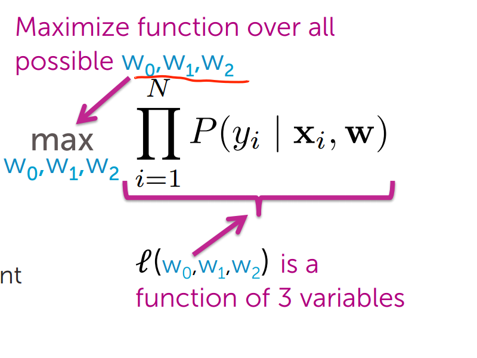
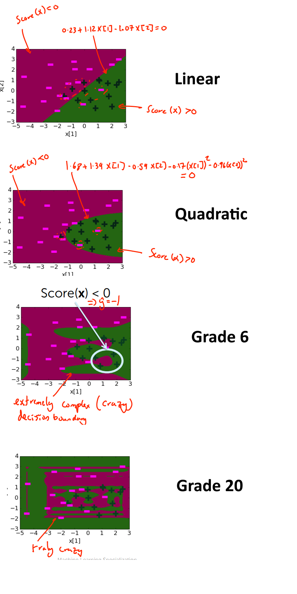
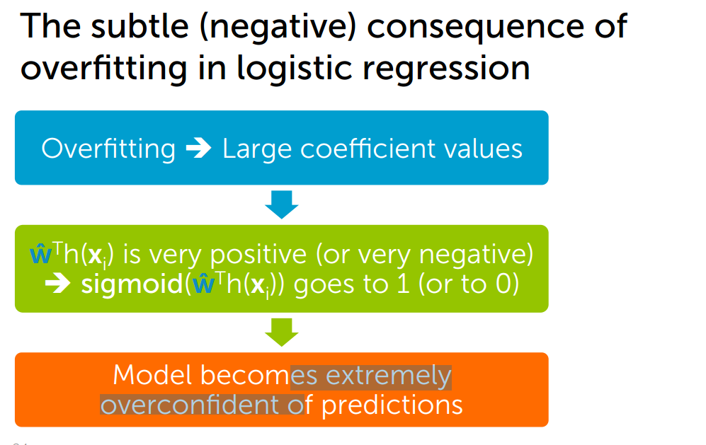
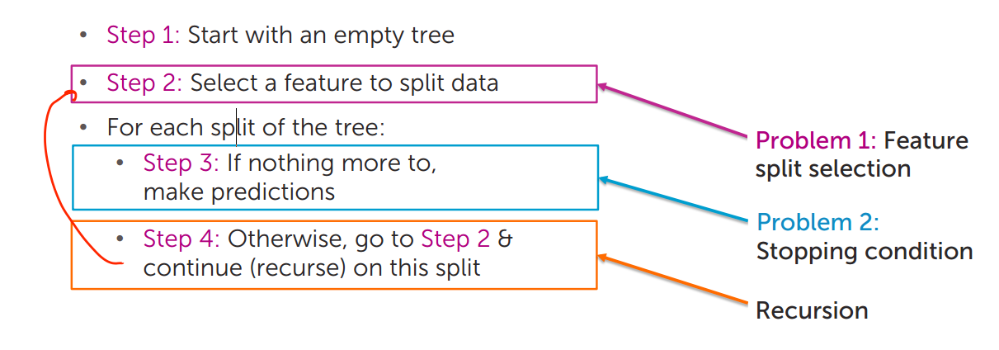
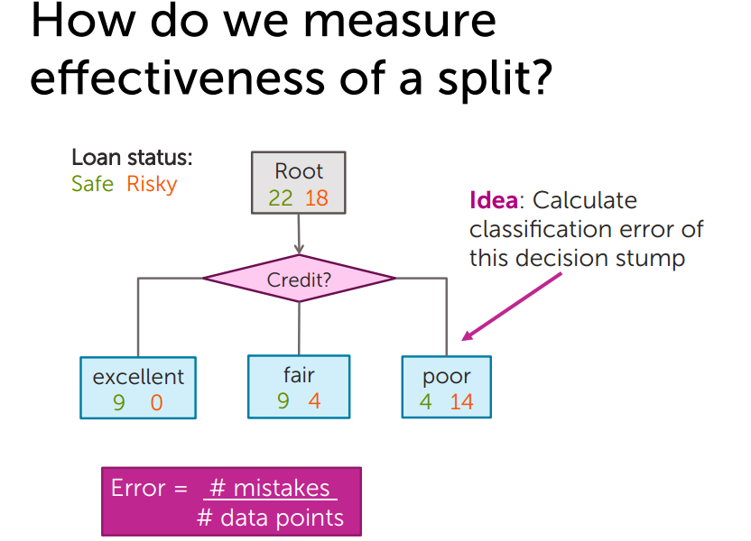

# Logistic Regression

## Intuition same spirit as Linear regression. 

For example: 3awesome + 2good +  -5 Terrible = Score

if(score  >   0) then Good Review
if(score  <=   0) then Bad Review

Let's take it one step further by making it a probability. And we use the Sigmoid function for that.

- Score(xi)	=	w * h(xi)
- Sigmoid(Score) = 1 / 1 + e^(-Score)
- P(y=+1|xi,w) = sigmoid(Score(xi))

Advantage is that This gives a measure of certainty. 

## Training

The model is trained by maximizing Maximun Likelihood Estimattion.

Maximize the Function Multiplication(  P ( yi | xi, w) )

How.. gradient ascent!!! There's no closed form. 

## Gradient ascent
- If step size is too small, can take along time to converge
- Very large step sizes can even cause divergence or wild oscillations
- Unfortunately, picking step sizerequires a lot of trial and error L
    - Try a several values, exponentially spaced
    - Goal: plot learning curves to    
        - find one η that is too small (smooth but moving too slowly)
        - find one η that is too large (oscillation or divergence)
    - Try values in between to find “best” η
    - Advanced tip: can also try step size that decreases with iterations, e.g

## Classification Error

- Error = # Mistakes / Number of data points
- Accuracy = # Correct  / Number of data points

## Classification Overfitting 

# Decision Tree

