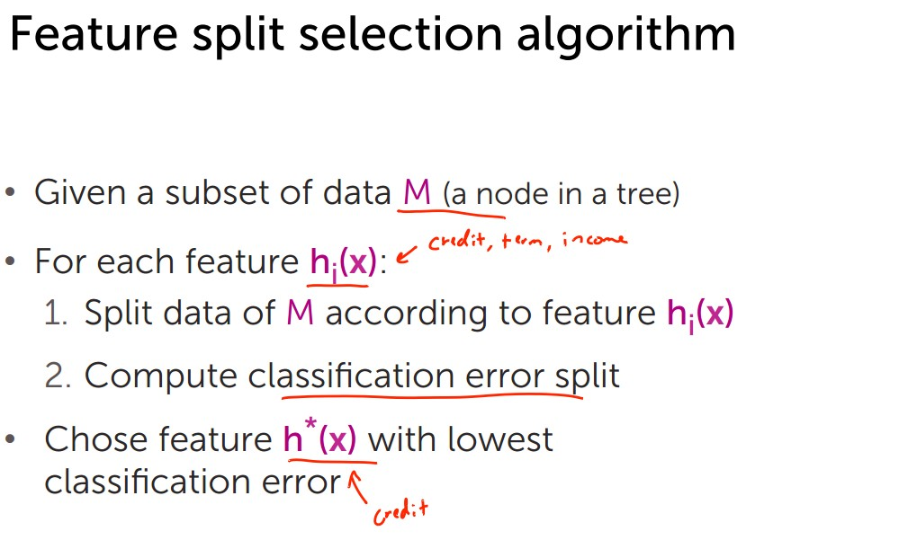
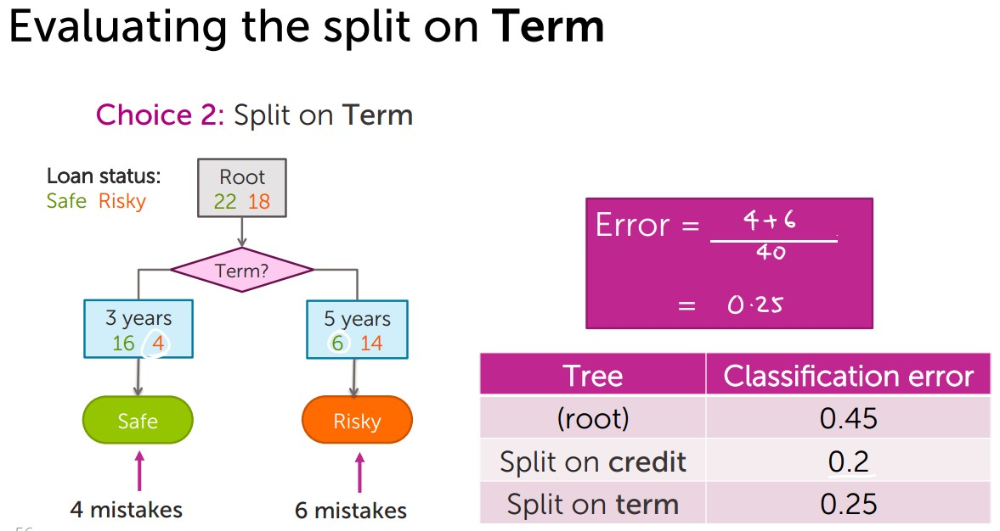
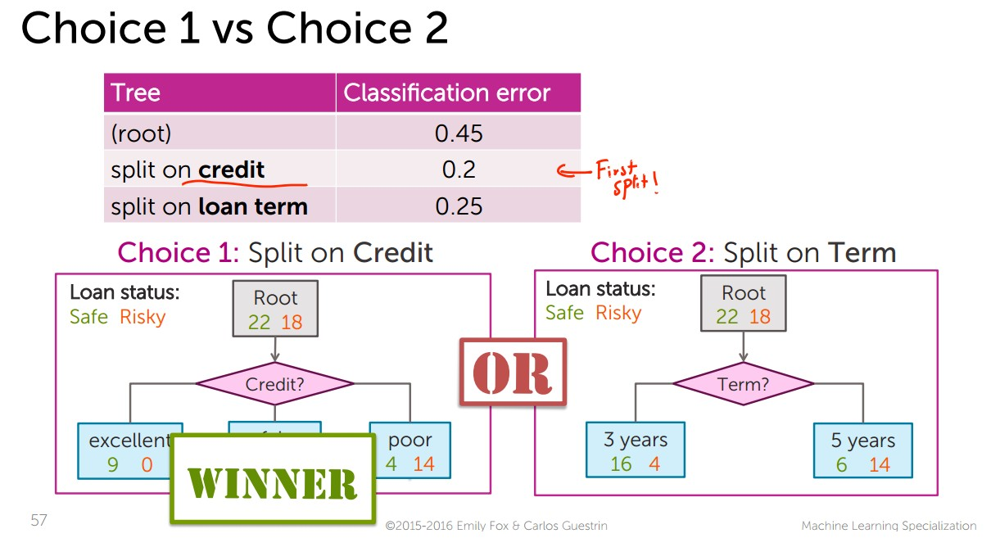
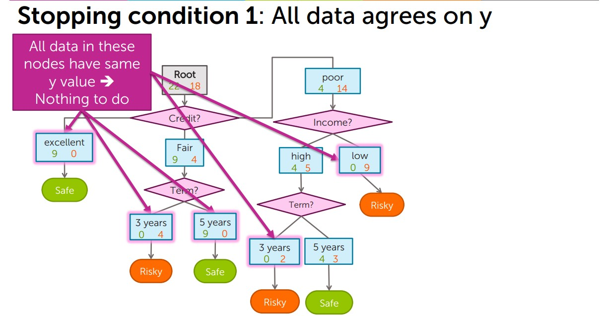
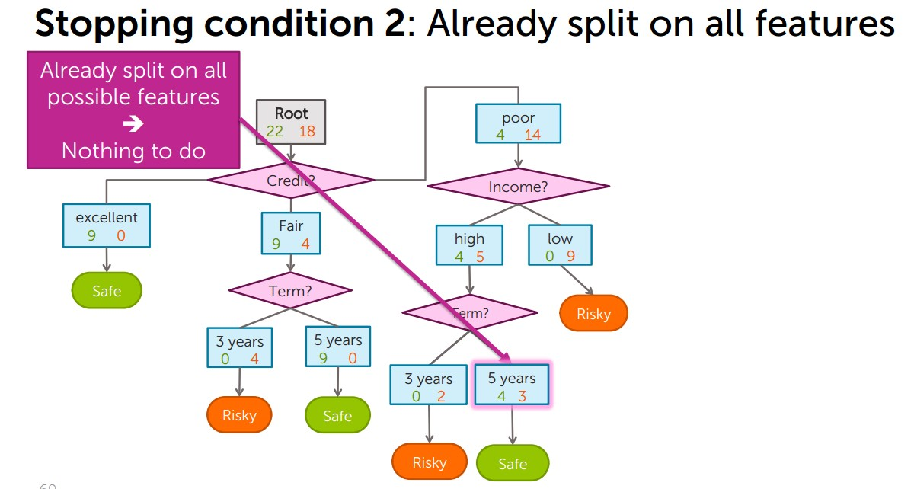
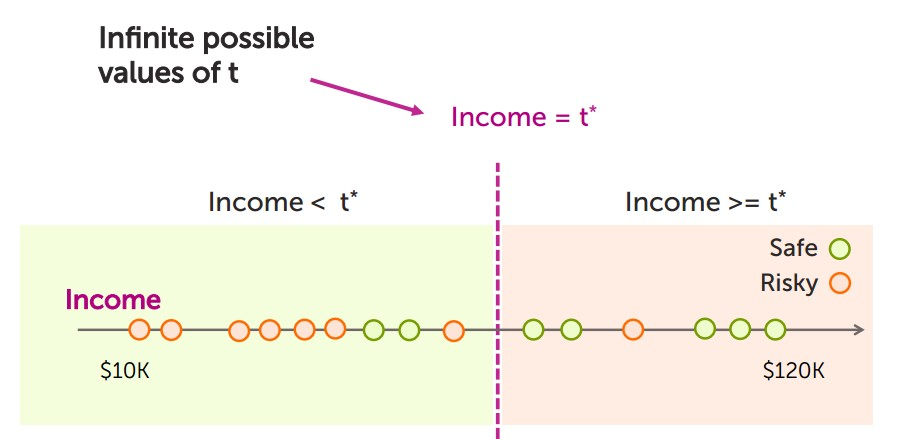
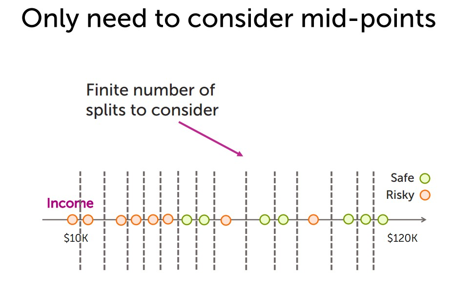

# Logistic Regression

## Intuition same spirit as Linear regression. 

For example: 3awesome + 2good +  -5 Terrible = Score

if(score  >   0) then Good Review
if(score  <=   0) then Bad Review

Let's take it one step further by making it a probability. And we use the Sigmoid function for that.

- Score(xi)	=	w * h(xi)
- Sigmoid(Score) = 1 / 1 + e^(-Score)
- P(y=+1|xi,w) = sigmoid(Score(xi))

Advantage is that This gives a measure of certainty. 

## Training

The model is trained by maximizing Maximun Likelihood Estimattion.

Maximize the Function Multiplication(  P ( yi | xi, w) )

How.. gradient ascent!!! There's no closed form. 

## Gradient ascent
- If step size is too small, can take along time to converge
- Very large step sizes can even cause divergence or wild oscillations
- Unfortunately, picking step sizerequires a lot of trial and error L
    - Try a several values, exponentially spaced
    - Goal: plot learning curves to    
        - find one η that is too small (smooth but moving too slowly)
        - find one η that is too large (oscillation or divergence)
    - Try values in between to find “best” η
    - Advanced tip: can also try step size that decreases with iterations, e.g

## Classification Error

- Error = # Mistakes / Number of data points
- Accuracy = # Correct  / Number of data points

## Classification Overfitting 

# Decision Tree

## Stopping conditions

## Splitting on numeric variables

## Overfitting in decision Trees

By design, each split  on the tree reduces training error 

How do we pick simpler trees?

- Early Stopping: Stop learning algorithm before tree become too complex
    - Limit tree depth: Stop splitting after a certain depth
    - Classification error: Do not consider any split that does not cause a sufficient decrease in classification error
    - Minimum node “size”: Do not split an intermediate node which contains too few data points
- Pruning: Train a complex tree, simplify later
    - L(T) depth of node = Measure of complexiy
    - balance between complexity and predicive power
    - Total cost = measure of fit + measure of complexity
    - Total cost C(T) = Error(T) + λ L(T)

# Boosting

- Set of weak (simple learnins, with low variance, high bias and easy to train) are combined to create stornger learner.
Ensemble classifier in general
- Goal:
    - Predict output y:   Either +1 or -1
    - From input x
- Learn ensemble model:
    - Classifiers: f1(x),f2(x),…,fT(x)
    - Coefficients: ŵ1,ŵ2,…,ŵT
- Prediction: y = sign( Sum ( ŵt ft (x )) 
- Start by training a classifier
- Train next classifier focusing on places where f(x) does less well

Learning on weighted data:
More weight on "hard" or more important points
- Weighted dataset:
    - Each xi,yi weighted by αi
        - More important point = higher weight αi
- Learning:
    - Data point j counts as αi data points
        - E.g., αi = 2 ->  count point twice

- Training error of boosted classifier → 0 as T→∞
- Boosting tends to be robust to overfitting 
- But boosting will eventually overfit, so must choose max number of components T
- Use Validation set or cross validation to choose  T

## Random Forest

- Pick random subset of data
    - Learn a tree in each subset
    - Average predictions
 - Simpler than boosting & easier to parallelize
 - Tipycall higher error than boosting for same number of trees.
 
 ##  Gradient boosting
 
Like AdaBoost, but useful beyond basic classification
